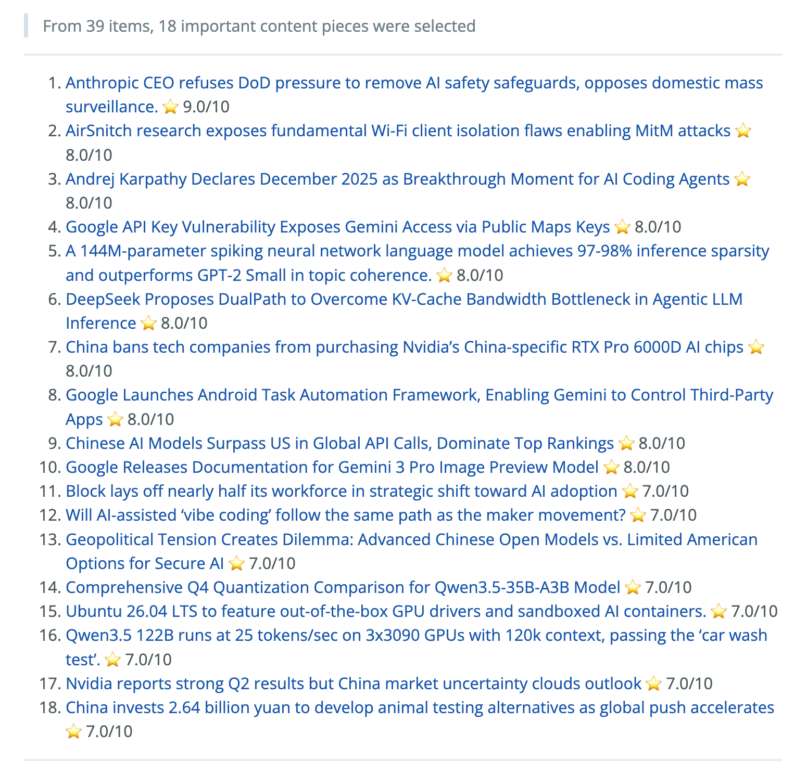
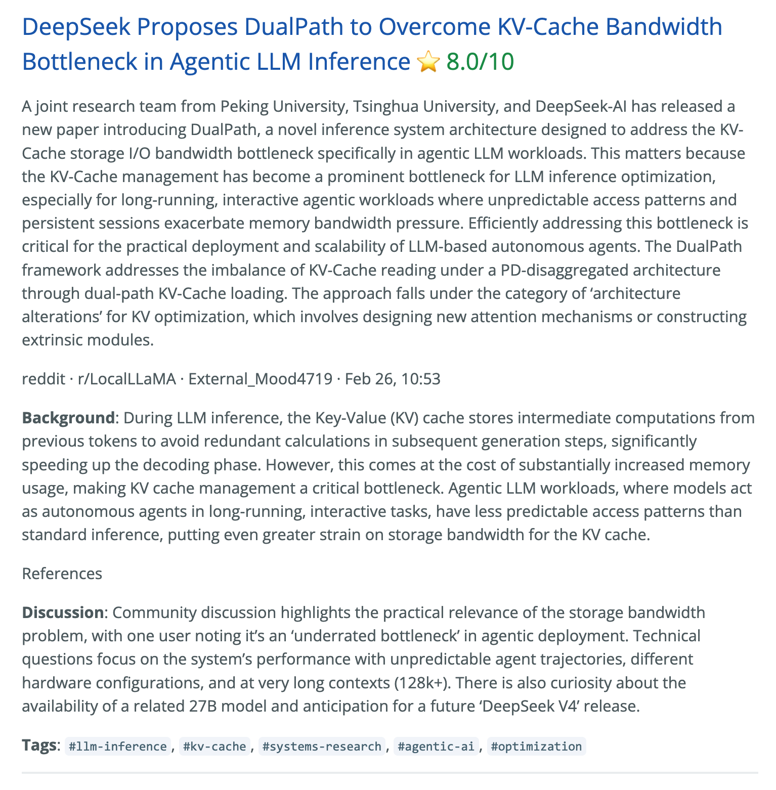
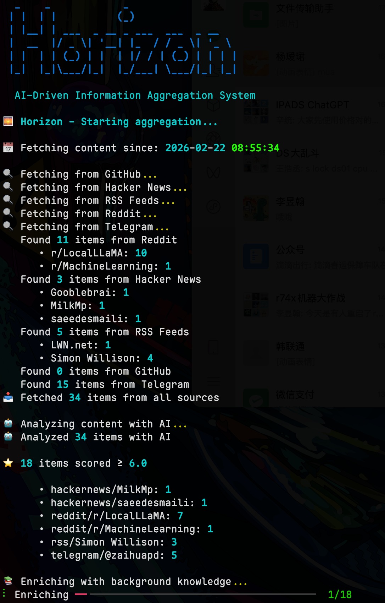

<div align="center">

# 🌅 Horizon

**AI curates the tech news. You just read.**

[](https://www.python.org/downloads/)
[](LICENSE)
[](https://github.com/astral-sh/uv)
[](https://thysrael.github.io/Horizon/)
[](https://github.com/Thysrael/Horizon/commits/main)
[](http://makeapullrequest.com)

<br>


Horizon collects news from multiple customizable sources, uses AI to score and filter them, and generates a daily briefing — complete with summaries, community discussions, and background explanations in both English and Chinese.

[📖 Live Demo](https://thysrael.github.io/Horizon/) · [📋 Configuration Guide](https://thysrael.github.io/Horizon/configuration) · [简体中文](README_zh.md)

</div>

## Screenshots

<table>
<tr>
<td width="50%">
<p align="center"><strong>Daily Overview</strong></p>

</td>
<td width="50%">
<p align="center"><strong>News Detail</strong></p>

</td>
</tr>
</table>

<details>
<summary><strong>Terminal Output</strong></summary>
<br>
<p align="center">
  
</p>
</details>

## Features

- **📡 Multi-Source Aggregation** — Collects from Hacker News, RSS feeds, Reddit, Telegram channels, and GitHub (releases & user events)
- **🤖 AI-Powered Scoring** — Uses Claude, GPT-4, Gemini, DeepSeek, Doubao, MiniMax, or any OpenAI-compatible API to rate each item 0-10, filtering out the noise
- **🌐 Bilingual Summaries** — Generates daily reports in both English and Chinese
- **🔍 Content Enrichment** — Searches the web to provide background knowledge for unfamiliar concepts
- **💬 Community Voices** — Collects and summarizes discussions from comments on HackerNews, Reddit, etc.
- **🔗 Cross-Source Deduplication** — Merges duplicate items from different platforms automatically
- **📧 Email Subscription** — Self-hosted newsletter system (SMTP/IMAP) that handles "Subscribe" requests automatically
- **📝 Static Site Generation** — Deploys as a GitHub Pages site via GitHub Actions, updated on a schedule
- **⚙️ Fully Configurable** — Single JSON config file, easy to customize sources, thresholds, and AI providers
- **🧙 Setup Wizard** — Interactive CLI that recommends sources based on your interests, with a [curated preset library](https://thysrael.github.io/Horizon/presets) open to community contributions

## How It Works

```
              ┌──────────┐
              │ Hacker   │
┌─────────┐   │ News     │   ┌──────────┐   ┌──────────┐   ┌──────────┐
│  RSS    │──▶│ Reddit   │──▶│ AI Score │──▶│ Enrich   │──▶│ Summary  │
│ Telegram│   │ GitHub   │   │ & Filter │   │ & Search │   │ & Deploy │
└─────────┘   └──────────┘   └──────────┘   └──────────┘   └──────────┘
  Fetch from      Merge &        Score          Web search     Generate
  all sources    deduplicate     0-10 each      background     Markdown &
                                & filter        knowledge      deploy site
```

1. **Fetch** — Pull latest content from all configured sources concurrently
2. **Deduplicate** — Merge items pointing to the same URL across different platforms
3. **Score** — AI rates each item 0-10 based on technical depth, novelty, and impact
4. **Filter** — Keep only items above your configured threshold (default: 6.0)
5. **Enrich** — For high-scoring items, search the web for background context and collect community discussions
6. **Summarize** — Generate a structured Markdown report with summaries, tags, and references
7. **Deploy** — Optionally publish to GitHub Pages as a daily-updated static site

## Quick Start

### 1. Install

#### Option A: Local Installation

```bash
git clone https://github.com/Thysrael/Horizon.git
cd horizon

# Install with uv (recommended)
uv sync

# Or with pip
pip install -e .
```

#### Option B: Docker

```bash
git clone https://github.com/Thysrael/Horizon.git
cd horizon

# Configure environment
cp .env.example .env
# Edit .env with your API keys and provider settings

# Run with Docker Compose
docker-compose run --rm horizon --industry healthcare

# Or run with custom time window
docker-compose run --rm horizon --industry healthcare --hours 48
```

### 2. Configure

**Option A: Layered config for industry-specific runs (recommended)**

Horizon now supports a shared base config plus one industry file per run:

```text
data/config/
  base.json
  industries/
    ai-tech.json
    healthcare.json
    gaming.json
```

`base.json` stores shared runtime settings such as AI provider, thresholds, and output directories. Each industry file stores the source list plus industry-specific scoring guidance, including `profile.score_bands`, `scoring_focus`, and `downrank_if`. Example files ship with the repo:

- `data/config/base.json`
- `data/config/industries/ai-tech.json`
- `data/config/industries/healthcare.json`
- `data/config/industries/gaming.json`

Typical setup:

```bash
cp .env.example .env
# Edit data/config/base.json and data/config/industries/<industry>.json
```

Key output settings live under `output` in `base.json`:

```jsonc
{
  "output": {
    "summaries_dir": "data/summaries",
    "docs_posts_dir": "docs/_posts",
    "publish_to_docs": true,
    "include_industry_in_filename": true
  }
}
```

**Option B: Interactive wizard (legacy single-file config)**

```bash
uv run horizon-wizard
```

The wizard asks about your interests (e.g. "LLM inference", "嵌入式", "web security") and auto-generates `data/config.json` from a [curated preset library](https://thysrael.github.io/Horizon/presets) + optional AI recommendations.

**Option C: Manual legacy configuration**

```bash
cp .env.example .env          # Add your API keys
cp data/config.example.json data/config.json  # Customize your sources
```

Here's what a config looks like:

```jsonc
{
  "ai": {
    "provider": "openai",       // or "anthropic", "gemini", "doubao", "minimax"
    "model": "gpt-4",
    "api_key_env": "OPENAI_API_KEY",
    "languages": ["en", "zh"]   // bilingual output
  },
  "sources": {
    "hackernews": { "enabled": true, "fetch_top_stories": 20, "min_score": 100 },
    "rss": [
      { "name": "Simon Willison", "url": "https://simonwillison.net/atom/everything/" }
    ],
    "reddit": {
      "subreddits": [{ "subreddit": "MachineLearning", "sort": "hot" }],
      "fetch_comments": 5
    },
    "telegram": {
      "channels": [{ "channel": "zaihuapd", "fetch_limit": 20 }]
    }
  },
  "filtering": {
    "ai_score_threshold": 6.0,
    "time_window_hours": 24
  },
  "profile": {
    "audience": "AI engineers, software developers, and readers tracking tech shifts",
    "score_bands": {
      "9_10": [
        "Breakthroughs in models, inference systems, or chip stacks",
        "Events that materially change developer workflows or industry structure"
      ],
      "0_2": [
        "Marketing-heavy content with little evidence",
        "Low-signal posts with minimal relevance to the target domain"
      ]
    },
    "scoring_focus": [
      "Technical depth, originality, and information density",
      "Potential impact on developers or the broader ecosystem"
    ]
  }
}
```

For the full reference, see the [Configuration Guide](docs/configuration.md).

### 3. Run

#### Local Installation

```bash
uv run horizon --industry ai-tech                     # Run the default AI/tech config
uv run horizon --industry healthcare                  # Run the healthcare config
uv run horizon --industry gaming                      # Run the gaming config
uv run horizon --industry healthcare --hours 48      # Override the time window
uv run horizon --industry healthcare --source rss    # Restrict to selected sources
uv run horizon --industry healthcare --source rss,reddit
uv run horizon --industry healthcare --print-effective-config
uv run horizon --industry healthcare --base-config data/config/base.json
uv run horizon --industry healthcare --industry-config data/config/industries/healthcare.json

# Legacy single-file mode remains available
uv run horizon
uv run horizon --hours 48
```

#### With Docker

```bash
docker-compose run --rm horizon --industry ai-tech
docker-compose run --rm horizon --industry healthcare --hours 48
```

Generated reports are saved to the directory configured in `output.summaries_dir`. When `include_industry_in_filename` is enabled, filenames look like `horizon-healthcare-2026-03-25-en.md`.

#### Command Reference

- `--industry <id>`: load `data/config/base.json` plus `data/config/industries/<id>.json`
- `--base-config <path>`: override the default base config path
- `--industry-config <path>`: override the default industry config path
- `--hours <n>`: fetch the last `n` hours instead of the configured time window
- `--source <csv>`: run only selected source types such as `rss,reddit`
- `--print-effective-config`: print the merged config and exit

### 4. Automate (Optional)

Horizon works great as a **GitHub Actions** cron job. See [`.github/workflows/daily-summary.yml`](.github/workflows/daily-summary.yml) for a ready-to-use workflow that generates and deploys your daily briefing to GitHub Pages automatically.

## Supported Sources

| Source | What it fetches | Comments |
|--------|----------------|----------|
| **Hacker News** | Top stories by score | Yes (top N comments) |
| **RSS / Atom** | Any RSS or Atom feed | — |
| **Reddit** | Subreddits + user posts | Yes (top N comments) |
| **Telegram** | Public channel messages | — |
| **GitHub** | User events & repo releases | — |

## MCP Integration

Horizon ships with a built-in [MCP](https://modelcontextprotocol.io/) server so AI assistants can drive the pipeline programmatically.

```bash
# Start the MCP server (stdio mode)
uv run horizon-mcp
```

Available tools include `hz_validate_config`, `hz_fetch_items`, `hz_score_items`, `hz_filter_items`, `hz_enrich_items`, `hz_generate_summary`, and `hz_run_pipeline`.

See [`src/mcp/README.md`](src/mcp/README.md) for the full tool reference and [`src/mcp/integration.md`](src/mcp/integration.md) for client setup.

## Roadmap

- [x] Multi-source aggregation (HN, RSS, Reddit, Telegram, GitHub)
- [x] AI scoring with multiple providers
- [x] Bilingual summary generation (EN/ZH)
- [x] Web search for background enrichment
- [x] Community discussion collection
- [x] GitHub Pages deployment
- [x] **Email Subscription** (SMTP/IMAP automated newsletter)
- [x] **Docker deployment support**
- [x] **MCP server integration**
- [x] Web UI dashboard
- [x] **Setup Wizard** — interactive CLI that recommends sources based on user interests
- [ ] **Improved Web UI** — better digest and article detail experience
- [ ] Slack / Webhook notification
- [ ] More source types (Twitter/X, Discord, etc.)
- [ ] Custom scoring prompts per source

## Contributing

Contributions are welcome! Feel free to open issues or submit pull requests.

### 📡 Contribute Source Presets

Horizon's setup wizard uses a community-maintained [preset library](https://thysrael.github.io/Horizon/presets) to recommend sources. **We'd love your help expanding it!**

1. Fork this repo
2. Add your sources to `data/presets.json` (provide both English and Chinese descriptions)
3. Submit a PR

Great candidates: niche RSS feeds, active subreddits, notable GitHub accounts, or Telegram channels in your area of expertise.

## License

[MIT](LICENSE)
